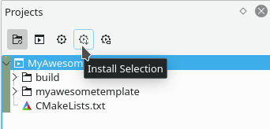

### %{APPNAME} template

This template is packaged using CMake.
To install it you can run:  
```bash
mkdir -p build
cd build
cmake ..
cmake --build . --target install
```

After this the template shows up in the dialog under File -> New From Template.

You can also do this graphically using KDevelop:  


If you think that the template can be useful to other people,
consider uploading it to the KDE store https://store.kde.org/browse/cat/327/.

In case you have an older version of the KDE Frameworks(<5.77)
you have to delete the old tar to make sure it gets recreated.
This can be done using the clean button in KDevelop
(on the right of the "Install Selection" button in the screenshot)
or by running this command in the build directory:
```bash
cmake --build . --target clean
```

It you want to create multiple templates you can add new directories to the root
of this project and add them to the template package macro:  
```cmake
kde_package_app_templates(TEMPLATES "%{APPNAMELC}" "mysecondtemplate" INSTALL_DIR ...)
```

